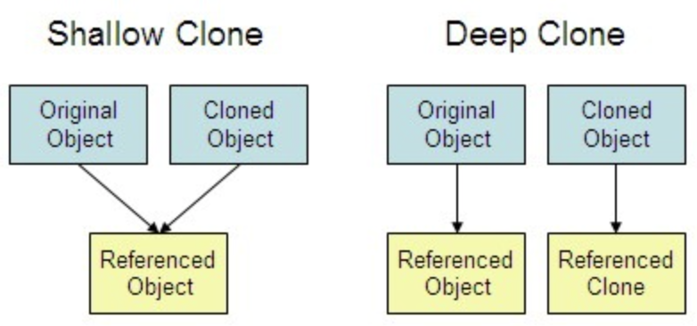
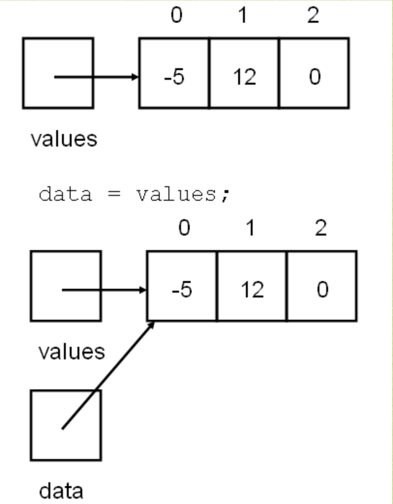
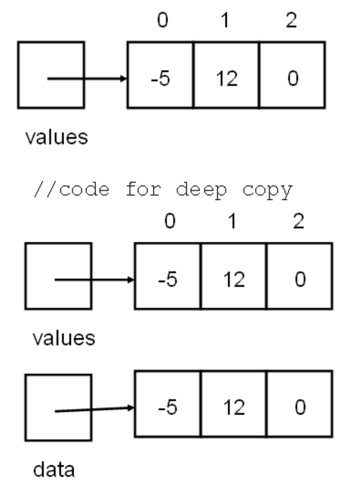

<h1> Deep vs shallow copy </h1>

In general, creating a copy of an object means to create an exact replica of the object
having the same literal value, data type, and resources. (made by Copy Constructor or assignment operator..)



<h2> Shallow Copy </h2>

- In shallow copy, an object is created by simply copying the data of all variables of the original object. This works well if none of the variables of the object are defined in the heap section of memory. If some variables are dynamically allocated memory from heap section, then copied object variable will also reference then same memory location.
  This will create ambiguity and run-time errors dangling pointer. Since both objects will reference to the same memory location, then change made by one will reflect those change in another object as well. Since we wanted to create a replica of the object, this purpose will not be filled by Shallow copy.
  Note: C++ compiler implicitly creates a copy constructor and overloads assignment operator in order to perform shallow copy at compile time.

    

- shallow copy example;

```c++
class ShallowCopy{
private
	int a;
public:
	ShallowCopy(int a){
		this->a = a;
	}
	ShallowCopy(const ShallowCopy& obj){
		*this = obj;
	}
	ShallowCopy& operator=(const ShallowCopy& obj){
		this->a = obj.a;
	}
};
```

* In order to avoid this ambiguity, we can use the following technique to create a shallow copy of an object.
	- Create a new object of the same type as the original object.
	- Copy the data of all variables of the original object to the new object.
	- Return the new object.
	(next section)

<h2> Deep Copy </h2>

* In Deep copy, an object is created by copying data of all variables and it also allocates similar memory resources with the same value to the object. In order to perform Deep copy, we need to explicitly define the copy constructor and assign dynamic memory as well if required. Also, it is required to dynamically allocate memory to the variables in the other constructors, as well





- deep copy example;

``` c++
class DeepCopy{
private:
	int *a;
public:
	DeepCopy(int a)
	{
		this->a = new int(a);
	}
	DeepCopy(const DeepCopy& obj)
	{
		*this = obj;
	}
	DeepCopy& operator=(const DeepCopy& obj)
	{
		this->a = new int(\*obj.a);
	}
};
```

- SOURCES

[Deep and Shallow Copying](https://www.cs.utexas.edu/~scottm/cs307/handouts/deepCopying.htm)

[Deep and Shallow Copying 2](https://owlcation.com/stem/Copy-Constructor-shallow-copy-vs-deep-copy)
